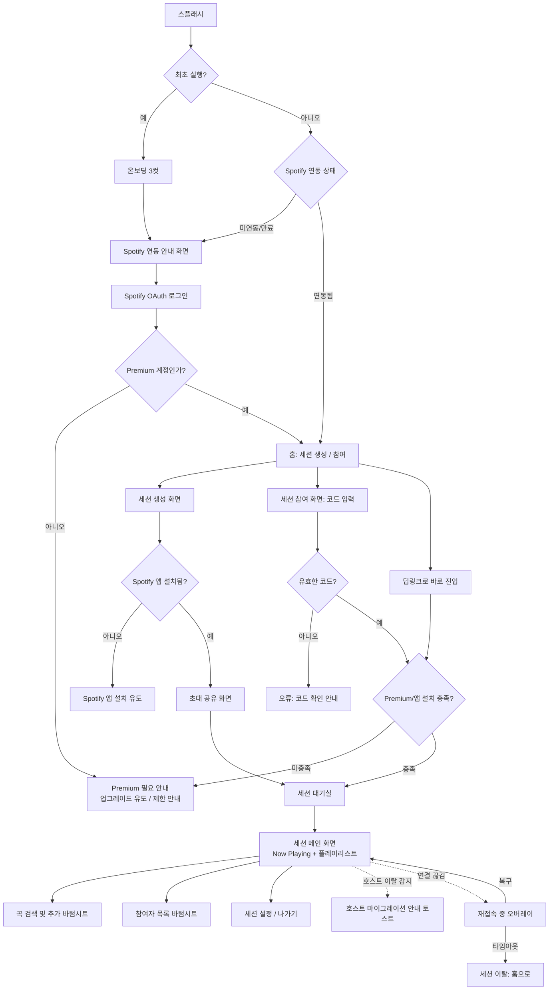

# 00. UX 플로우 및 화면 구성 (MVP)

> 상태: 초안(v1) — 2026-07-23
> 작성: 디자인 서브에이전트
> 범위: `docs/specs/06-mvp-scope-and-tech-stack.md`의 MVP 권고 범위(Spotify 전용, 세션 생성/참여, 협업 플레이리스트, 재생 동기화)에 대응하는 화면만 다룬다. YouTube 지원, 채팅/리액션, 플레이리스트 저장/export 등 `[P2]` 항목은 이 문서에서 화면을 만들지 않는다(용어상 언급만 함).
> 표현 방식: 실제 픽셀 목업이 아닌 ASCII 와이어프레임 + mermaid 플로우로 구조를 전달한다. 색상/폰트는 `01-style-guide.md` 참고.

## 0. 이 문서의 설계 원칙

1. **투명성 우선(US-406)**: "우리 서버가 음악을 스트리밍하는 게 아니라, 각자의 Spotify 앱이 로컬로 재생하고 우리는 그것을 맞춰준다"는 사실을 사용자가 오해하지 않도록 온보딩과 세션 화면 곳곳에서 반복적으로, 그러나 부담스럽지 않게 노출한다.
2. **선곡자 가시성**: 협업 플레이리스트의 모든 곡에 "누가 넣었는지"가 항상 보여야 한다 (`02-key-ui-patterns.md`에서 상세).
3. **동기화 상태 가시성**: 사용자가 "지금 다들 같은 곳을 듣고 있는지"를 언제나 한눈에 확인할 수 있어야 한다 (`02-key-ui-patterns.md`에서 상세).
4. **Premium 게이팅과 앱 설치 요건을 조기에, 친절하게 안내**: `02-spotify-integration.md`의 제약(전원 Premium, Spotify 공식 앱 설치 필수)을 사용자가 세션에 깊이 들어가기 전에 알게 해서, 나중에 좌절하지 않게 한다.
5. **최소 탭 구조**: MVP 범위가 크지 않으므로 화면 계층을 얕게 유지한다 (하단 탭 없이, 스택 기반 네비게이션 + 세션 내부만 2탭 정도).

## 1. 전체 플로우 개요 (mermaid)



## 2. 화면별 상세

### 2.1 스플래시 (Splash)

- 로고 + 앱 이름만 짧게. 아래에 "장거리에서도, 같은 순간에" 같은 한 줄 태그라인(카피는 추후 확정, 여기선 톤 예시).
- 목적: Spotify 연동 상태 확인 + 세션 재접속 여부 체크하는 동안의 로딩 화면.

### 2.2 온보딩 (최초 실행 시, 3컷 카드형, US-601)

```
┌─────────────────────────┐
│        [일러스트]         │
│                          │
│  "같은 곡을, 같은 순간에"   │
│  멀리 있어도 함께 듣는 방을  │
│  만들어보세요              │
│                          │
│   ● ○ ○        [다음]    │
└─────────────────────────┘
```

- 1컷: 핵심 가치("같은 곡을 같은 순간에 함께").
- 2컷: 협업 플레이리스트("누구나 곡을 추가하고, 누가 골랐는지 표시돼요").
- 3컷: **투명성 카드(US-406 대응)** — "재생은 각자의 Spotify 앱에서 이뤄져요. feel_music_share는 그걸 맞춰주는 역할이에요." + 아이콘으로 "서버가 오디오를 흘려보내지 않음"을 시각화(예: 두 스마트폰이 나란히, 각자 스피커 아이콘 + 가운데 동기화 화살표).
- 마지막 컷 CTA: "Spotify로 시작하기".

### 2.3 Spotify 연동 안내 → OAuth 로그인 (US-101, US-102)

```
┌─────────────────────────┐
│   [Spotify 로고]          │
│                          │
│  feel_music_share는      │
│  Spotify Premium 계정이   │
│  필요해요                 │
│                          │
│  - 곡을 직접 골라 재생하려면 │
│    Premium이 필요합니다    │
│  - 계정 정보는 로그인 시    │
│    안전하게 확인해요        │
│                          │
│  [ Spotify로 로그인 ]      │
│  Premium이 없으신가요? →   │
└─────────────────────────┘
```

- 로그인은 시스템 브라우저/공식 OAuth 플로우 경유(임베드 웹뷰 아님 — `02-spotify-integration.md` 참고).
- 로그인 완료 후 Web API로 구독 등급 조회 → 분기.

### 2.4 Premium 아님 안내 (US-102)

```
┌─────────────────────────┐
│      [안내 아이콘]         │
│                          │
│  Premium 계정이 아니에요    │
│                          │
│  feel_music_share의 실시간│
│  동기화 재생은 Spotify     │
│  Premium에서만 가능해요.   │
│  Free 계정으로는 곡을 직접  │
│  골라 재생할 수 없어요.     │
│                          │
│  [ Spotify Premium 알아보기]│
│  [ 나중에 다시 확인 ]        │
└─────────────────────────┘
```

- 정책 확정 사항 아님(막을지/부분 허용할지는 `02-spotify-integration.md` 제약 2에서 "사용자 확인 필요"로 남아있음) — 이 화면은 "차단"을 기본값으로 그리되, 실제 정책이 확정되면 문구/버튼만 조정하면 되도록 독립 컴포넌트로 설계.
- 세션에 "듣기 전용"으로 참여하는 대안이 채택될 경우를 대비해 두 번째 버튼 자리를 비워둠(플레이스홀더로 표기).

### 2.5 홈 (Home)

```
┌─────────────────────────┐
│  feel_music_share    ⚙  │
│                          │
│   지금 이 순간을 함께      │
│                          │
│  [  + 새 세션 만들기   ]   │
│  [  # 코드로 참여하기  ]   │
│                          │
│  최근 세션 (있다면)         │
│  ┌──────────────────┐   │
│  │ ♪ 우리 둘의 플레이리스트│   │
│  │ 3명 · 어제 활동        │   │
│  └──────────────────┘   │
└─────────────────────────┘
```

- 세션 생성/참여 두 개의 큰 CTA가 핵심. "최근 세션" 목록은 있으면 재입장 단축용(세션 자체가 저장/재사용되는 것은 아니고 `[P2]`인 "플레이리스트 재사용"과는 별개로, 활성 세션에 다시 들어가는 용도).

### 2.6 세션 생성 (US-201, US-105)

```
┌─────────────────────────┐
│  ← 세션 만들기            │
│                          │
│  세션 이름                │
│  [ 우리 둘의 플레이리스트 ] │
│                          │
│  음악 서비스               │
│  ( ● ) Spotify            │
│  ( ○ ) YouTube (준비 중)  │
│                          │
│  ⓘ 이 방은 Spotify 전용이  │
│  에요. 참여자 모두 Spotify  │
│  Premium이 필요해요.       │
│                          │
│  [   세션 만들기   ]       │
└─────────────────────────┘
```

- US-105(서비스 혼용 금지) 정책을 라디오 버튼 + 안내 문구로 명확히 표현. YouTube는 "준비 중"으로 비활성 처리하여, 향후 2차 단계에서 활성화만 하면 되는 구조로 설계.
- 방 생성 직후 Spotify 앱 미설치 감지 시 2.6a로 분기.

### 2.6a Spotify 앱 설치 유도 (제약 1)

```
┌─────────────────────────┐
│    [Spotify 앱 아이콘]     │
│                          │
│  Spotify 앱이 필요해요     │
│                          │
│  feel_music_share는 여러분│
│  기기에 설치된 Spotify 앱을│
│  통해 음악을 재생해요.      │
│                          │
│  [ App Store에서 설치 ]    │
│  [ 설치 완료, 다시 확인 ]   │
└─────────────────────────┘
```

### 2.7 초대 공유 (US-201)

```
┌─────────────────────────┐
│  세션이 만들어졌어요! 🎉   │
│                          │
│      [ QR 코드 ]          │
│                          │
│      초대 코드: 7F3K9Q     │
│                          │
│  [ 링크 공유하기 ]         │
│  [ 코드 복사 ]             │
│                          │
│  [   세션 입장하기   ]     │
└─────────────────────────┘
```

- 공유 시트는 OS 기본 공유(메시지, 카카오톡 등)로 연결. 딥링크 + 표시용 6자리 코드 병행(음성/문자로 불러주기 쉬운 짧은 코드 — 실제 자릿수·충돌 방지 로직은 구현 단계 결정).

### 2.8 세션 참여 (US-202)

```
┌─────────────────────────┐
│  ← 세션 참여하기           │
│                          │
│  초대 코드를 입력하세요     │
│  [ _ _ _ _ _ _ ]          │
│                          │
│  또는 QR 스캔 [카메라 아이콘]│
│                          │
│  [    참여하기    ]        │
└─────────────────────────┘
```

- 딥링크로 진입 시 이 화면을 건너뛰고 바로 2.9(대기실) 또는 세션 메인으로 이동.
- 코드 오류 시 인라인 에러 메시지("코드를 다시 확인해주세요" 등, 구체적 카피는 추후).

### 2.9 세션 대기실 (참여 직후 짧게 노출, 선택적)

```
┌─────────────────────────┐
│  "우리 둘의 플레이리스트"   │
│  입장 준비 중...            │
│                          │
│  ✓ Spotify 연동 확인        │
│  ✓ 현재 재생 위치 동기화 중  │
│  ⏳ 참여자와 연결 중          │
│                          │
└─────────────────────────┘
```

- Late join sync(US-402)가 실제로 일어나는 짧은 순간을 사용자에게 "무슨 일이 벌어지고 있는지" 설명하는 화면. 1~2초 내 자동으로 세션 메인으로 전환되는 것을 전제로 짧고 가볍게 디자인.

### 2.10 세션 메인 화면 (핵심 화면)

두 개의 하위 뷰를 스와이프/탭으로 전환하는 구조를 제안: **Now Playing** / **플레이리스트**. (둘 다 항상 필요하지만 화면 밀도상 완전 통합보다 분리 후 상단 미니 플레이어로 연결하는 편이 낫다고 판단.)

#### 2.10a Now Playing 탭

```
┌─────────────────────────┐
│ 우리 둘의 플레이리스트 ▾  ⋮│
│                          │
│         [앨범 아트]        │
│                          │
│   곡 제목이 들어갑니다      │
│   아티스트 이름            │
│                          │
│   ◐ 이 곡은 민준님이 선곡   │  ← 선곡자 배지 (02 문서 참고)
│                          │
│  ─────●───────────────  │
│  1:32              3:45 │
│                          │
│   ⏮      ⏯      ⏭      │
│                          │
│  🟢 동기화됨 · 3명 함께 듣는 중│  ← 동기화 상태 (02 문서 참고)
│                          │
│  [프로필][프로필][프로필]  │  ← 참여자 아바타 스택 (탭 시 목록)
└─────────────────────────┘
```

- 재생 컨트롤은 US-405가 P2로 미뤄졌으므로 MVP에서는 전원에게 동일하게 노출(권한 제한 없음).
- 하단 "동기화됨 · 3명 함께 듣는 중"이 상시 노출되는 상태 바 — 앱의 핵심 가치를 계속 체감시키는 장치.

#### 2.10b 플레이리스트 탭

```
┌─────────────────────────┐
│ 우리 둘의 플레이리스트 ▾  ⋮│
│  Now Playing 미니바        │  ← 탭 전환해도 재생 상태 계속 보이도록 sticky
│  [앨범아트 소] 곡제목  ▶︎/⏸ │
│                          │
│  다음 곡들                 │
│  ┌──────────────────┐   │
│  │▶ 곡 A — 아티스트     │   │
│  │  🅢 지은            │   │ ← 재생 중 표시 + 선곡자
│  ├──────────────────┤   │
│  │  곡 B — 아티스트     │   │
│  │  🅜 민준        ⠿   │   │ ← 드래그 핸들
│  ├──────────────────┤   │
│  │  곡 C — 아티스트     │   │
│  │  🅢 지은        ⠿   │   │
│  └──────────────────┘   │
│                          │
│  재생 완료 (2곡) ▾ 접힘    │  ← 이미 재생된 곡은 기본 접힘
│                          │
│           [ + 곡 추가 ]    │
└─────────────────────────┘
```

- **디자인 결정(기획 04번 문서에서 "디자인 단계 결정"으로 위임된 사항)**: 이미 재생 완료된 곡과 대기 중인 곡을 시각적으로 분리한다.
  - "다음 곡들" 섹션만 드래그로 순서 변경 가능(드래그 핸들 ⠿ 노출).
  - "재생 완료" 섹션은 기본 접혀 있고, 펼쳐도 순서 변경 불가(읽기 전용 히스토리) — 이미 지나간 순서를 바꾸는 것은 사용자에게 혼란을 줄 수 있다고 판단.
  - 현재 재생 중인 곡은 "다음 곡들" 리스트 맨 위에 별도 강조(▶ 아이콘, 드래그 핸들 없음 — 재생 중인 곡을 실수로 옮기는 것을 방지).
- 곡 삭제는 각 항목 스와이프 또는 롱프레스 메뉴로 제공(실수 삭제 방지를 위해 확인 다이얼로그를 곁들이는 것을 제안 — 04문서의 "삭제 남용" 리스크 완화).

### 2.11 곡 검색 및 추가 (바텀시트, US-301)

```
┌─────────────────────────┐
│  ✕   곡 검색               │
│  [ 🔍 곡, 아티스트 검색 ]   │
│                          │
│  ┌──────────────────┐   │
│  │[아트] 곡 이름           │   │
│  │      아티스트 · 3:12   │   │
│  │                  [+]  │   │
│  ├──────────────────┤   │
│  │[아트] 곡 이름 (이미 있음)│   │
│  │      아티스트 · 3:40   │   │
│  │              [담김✓]  │   │
│  └──────────────────┘   │
└─────────────────────────┘
```

- 검색은 디바운스 적용(연타 방지, Spotify Web API 호출량 관리 차원).
- "이미 있음" 표기는 04 문서 정책(기본 허용 + UI 표시)을 반영.
- 추가 시 짧은 토스트: "곡이 추가됐어요" + 선곡자 아바타가 리스트에 애니메이션으로 나타나는 것을 제안(선곡 행위 자체를 축하하는 듯한 마이크로 인터랙션 — 톤 문서 참고).

### 2.12 참여자 목록 (바텀시트, US-203)

```
┌─────────────────────────┐
│  참여자 (3)                │
│                          │
│  [아바타] 지은 (호스트) 🟢 정상│
│  [아바타] 민준        🟡 지연 1.2s│
│  [아바타] 나(수아)     🟢 정상│
│                          │
└─────────────────────────┘
```

- 참여자별 연결 상태 아이콘/색(정상/지연/끊김)을 여기서도 상세히 보여줌 — Now Playing 탭의 전체 요약 배지와 상호보완.

### 2.13 세션 설정 / 나가기

```
┌─────────────────────────┐
│  ← 세션 설정               │
│                          │
│  초대 코드 다시 보기         │
│  Spotify 연동 상태 확인     │
│  [ 세션 나가기 ]            │
│  [ 세션 종료하기 ] (호스트만) │
└─────────────────────────┘
```

### 2.14 예외/엣지 상태 화면 (오버레이 형태, 전체 화면 전환 아님)

- **재접속 중 오버레이(US-206)**: 반투명 오버레이 + "연결이 불안정해요, 다시 연결하는 중..." + 스피너. 일정 시간 초과 시 "세션에서 나가기" 옵션 노출.
- **호스트 마이그레이션 토스트(US-204)**: "호스트가 자리를 비웠어요. 지은님이 새 호스트가 되었어요." 짧은 토스트로만 처리, 별도 화면 전환 없음(세션 지속성을 사용자가 체감하게 하는 것이 목적).
- **드리프트 보정 표시(US-403)**: Now Playing 탭 하단 상태 배지가 "동기화됨" → "맞추는 중..."으로 짧게 전환 후 자동 복귀. 상세는 `02-key-ui-patterns.md`.

## 3. 내비게이션 구조 요약

```
스택 루트: 스플래시 → (온보딩) → (Spotify 로그인) → 홈
홈
 ├─ 세션 생성 → 앱설치유도(조건부) → 초대공유 → 세션메인
 ├─ 세션 참여 → 세션메인
 └─ 딥링크 진입 → (대기실) → 세션메인

세션메인 (스와이프 탭 2개)
 ├─ Now Playing
 └─ 플레이리스트
     ├─ (바텀시트) 곡 검색/추가
     ├─ (바텀시트) 참여자 목록
     └─ (스택) 세션 설정
```

- 하단 탭바(bottom tab bar)는 MVP 범위에서 불필요하다고 판단(세션 밖에서 상시 노출할 정보가 "홈" 하나뿐). 세션 내부만 2탭으로 가볍게 유지.
- 세션 밖(홈)과 세션 안(Now Playing/플레이리스트)의 시각적 구분을 명확히 해서, "지금 내가 누군가와 연결된 세션 안에 있는지"를 항상 인지할 수 있게 한다(예: 세션 안에서는 헤더에 상시 동기화 상태 배지 노출).

## 4. 후속 논의가 필요한 사항 (리더 보고용)

1. Free 계정 사용자를 완전히 차단할지, "듣기 전용"으로 강등할지 — `02-spotify-integration.md` 제약 2에서 미확정. 이 문서는 두 정책 모두 수용 가능한 화면 구조(2.4)로 설계했으나, 최종 정책 확정 시 카피/버튼만 조정하면 된다.
2. 초대 코드 자릿수/유효기간, 최대 참여 인원(US-205, P2) 등은 기획에서 확정되지 않은 값 — 디자인은 가변 길이를 수용하는 구조로만 잡아둠.
3. "재생 완료 곡은 순서 변경 불가"는 이 문서에서 새로 내린 UX 결정이다(04번 문서가 디자인 단계 위임). 구현/검증 단계에서 이견 있으면 조정 가능.
