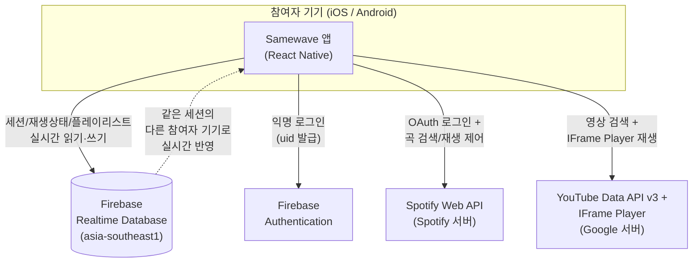

# 인프라·데이터 개요 (Firebase 역할 / 전체 구조 / 데이터 관리)

> 상태: 2026-07-27 기준 스냅샷 문서. 이 프로젝트는 계속 개발 중이라 여기 적힌 "완료"/"대기" 상태는 시간이 지나면 바뀐다 — 최신 진행 상태는 `docs/firebase-integration-guide.md`(Firebase 트랙)와 `docs/roadmap.md`(화면별 전체 현황)를 참고할 것. 이 문서는 그 두 문서와 달리 **"지금까지 무엇을 결정/구축했고, 전체적으로 어떻게 동작하는가"를 한 번에 설명하는 개요**가 목적이다.

## 한눈에 요약

이 앱(Samewave)은 **자체 서버를 직접 운영하지 않는다.** "백엔드 서버"에 해당하는 역할을 **Firebase**(Google이 관리하는 서버리스 백엔드 서비스, BaaS)가 대신한다. 즉:

- 우리가 코드를 배포해서 돌리는 서버 컴퓨터가 따로 없다 — Firebase Realtime Database가 곧 "서버가 관리하는 공유 데이터"의 역할을 한다.
- 앱(iOS/Android)은 Firebase RTDB, Spotify, YouTube 세 외부 서비스에 **각자 직접** 연결한다. 이 셋을 중계하는 우리 소유의 중간 서버는 없다.
- 실시간 동기화(같은 세션의 참여자들이 같은 곡/재생 위치를 실시간으로 보는 것)는 Firebase RTDB의 "실시간 구독(listener)" 기능으로 구현한다.

## 전체 구조 그림

**중요한 포인트**: Spotify/YouTube와의 통신은 Firebase를 거치지 않는다. 각 참여자의 앱이 Spotify/YouTube 서버에 **직접** 연결한다(곡 검색, 로그인, 재생 제어 전부). Firebase는 오직 "이 세션에 누가 있고, 지금 몇 번째 곡을 몇 초 지점에서 재생 중인지" 같은 **세션 상태 동기화 데이터**만 다룬다.

## Firebase가 실제로 하는 일

Firebase는 여러 하위 서비스로 구성된 묶음 상품인데, 이 프로젝트가 실제로 쓰는 건 두 가지뿐이다.

### 1. Realtime Database (RTDB) — 세션 상태 저장소 + 실시간 동기화

- **역할**: 세션(방) 데이터 — 참여자 목록, 초대 코드, (다음 라운드부터) 플레이리스트·재생 상태·매칭 정보를 저장하고, 같은 세션에 접속한 모든 기기에 변경 사항을 실시간으로 전파한다.
- **왜 RTDB인가(Firestore 대신)**: 이 앱의 핵심 요구사항이 "저지연 실시간 동기화"인데, RTDB가 "고빈도 소량 갱신 + 다수 동시 구독" 패턴에 최적화돼 있고 읽기 연산 자체가 무료라는 비용 구조도 유리해서 선택했다. 비교 근거는 `docs/spikes/firebase-rtdb-vs-firestore.md`, 최종 결정은 `docs/decision-log.md`(2026-07-27) 참고.
- **어디서 관리되는가**: Google Cloud의 **`asia-southeast1`(싱가포르) 리전**에서 호스팅된다. 인스턴스 URL: `https://feel-music-share-default-rtdb.asia-southeast1.firebasedatabase.app/`. 이건 우리가 서버를 고른 게 아니라 Firebase 콘솔에서 데이터베이스를 만들 때 선택한 리전이고, 실제 물리 서버·데이터센터 운영은 전적으로 Google이 담당한다 — 우리는 서버 유지보수·백업·장애 대응을 할 필요가 없다(그만큼 세부 인프라를 직접 통제할 수도 없다는 뜻이기도 하다).
- **트리 구조(무슨 데이터가 저장되는가)**: 세션마다 `/sessions/{세션ID}` 아래에 `meta`(이름/정원/방장), `participants`(참여자 목록), `playlists`/`mixedPlaylist`(곡 목록), `playback`(현재 재생 상태)이 나뉘어 저장되고, 초대 코드로 세션을 찾을 수 있도록 `/inviteCodes/{코드} → 세션ID` 역인덱스가 최상위에 따로 있다. 전체 스키마와 각 경로별로 누가 읽고/쓸 수 있는지는 `docs/specs/10-rtdb-schema-and-security-rules.md`에 상세히 정리돼 있다.

### 2. Authentication — 참여자 신원 확인(단, 익명)

- **역할**: 각 기기(정확히는 각 앱 실행 세션)에 Firebase가 서명한 고유 ID(`uid`)를 발급한다. RTDB 보안 규칙이 "이 데이터를 쓰려는 사람이 진짜 본인·방장이 맞는가"를 검증할 때 이 `uid`를 근거로 쓴다.
- **왜 "익명" 인증인가**: 이 앱은 이미 Spotify 계정으로 로그인하는 별도의 인증 흐름이 있다(아래 참고). Firebase 쪽에는 이메일/비밀번호 같은 진짜 회원 시스템을 또 만들 필요가 없어서, "신원까지는 확인 안 하지만 위조는 못 하는 고유 ID"만 주는 익명 인증을 택했다(`docs/decision-log.md` 2026-07-27, 무인증 방식과 비교해 익명 인증을 선택한 이유 포함). 앱을 지우고 다시 깔면 새 `uid`가 발급된다 — "같은 사람"이라는 연속성까지 보장하진 않는다.
- **관리 위치**: RTDB와 마찬가지로 Google이 운영하는 관리형 서비스라 우리가 직접 서버를 두지 않는다.

### Firebase가 아직 안 하는 일 (중요한 한계)

- **Cloud Functions(서버 코드 실행) 미도입**: 지금은 RTDB 보안 규칙이 사실상 유일한 "서버 측 검증 로직"이다. 나중에 필요할 수 있는 서버 전용 로직(예: 재생 명령의 권위 있는 타임스탬프 발급, 복잡한 검증)은 아직 없다.
- **플레이리스트/재생 상태/매칭/역할 관리는 아직 RTDB로 안 옮겨짐**: 지금 RTDB로 실제 연동된 건 "세션 생성/조회/참여"뿐이다(`sessionService.ts`의 `createSession`/`getSessionByInviteCode`/`joinSessionByCode`/`subscribeToSession`). 곡 추가/삭제/순서변경, 재생 제어, 관리자 임명 같은 기능은 **여전히 앱을 껐다 켜면 사라지는 인메모리(휘발성) 데이터**로 동작한다 — RTDB로 옮기는 작업이 여러 라운드에 걸쳐 진행 중이다(로드맵: `docs/specs/10-rtdb-schema-and-security-rules.md` "요구사항 3").
- **RTDB 보안 규칙이 아직 배포 전**(2026-07-27 기준): 규칙 초안(`database.rules.json`)은 작성됐지만 Firebase 콘솔에 아직 게시되지 않았다 — 그때까진 RTDB가 기본 잠금 상태라 read/write 자체가 거부된다.

## Spotify / YouTube는 Firebase와 무관하게 별도로 연동된다

| | Spotify | YouTube |
|---|---|---|
| 연동 방식 | 사용자가 자기 Spotify 계정으로 OAuth 로그인(PKCE), 이후 앱이 발급받은 토큰으로 Spotify Web API에 직접 요청(곡 검색, 재생 제어) | 로그인 없이 API 키만으로 공개 영상 검색(`YouTube Data API v3`), 재생은 IFrame Player를 WebView에 임베드 |
| 데이터가 어디를 거치는가 | 참여자 기기 ↔ Spotify 서버. Firebase를 거치지 않는다 | 참여자 기기 ↔ Google/YouTube 서버. Firebase를 거치지 않는다 |
| 현재 상태 | 로그인 동작 확인됨, 검색은 최근 수정(2026-07-27, `limit` 파라미터 값 버그) 후 실기기 재확인 대기 | 아직 API 키 발급 전 — 고정된 가짜 5곡짜리 목업 검색만 동작 |
| 참고 문서 | `docs/specs/02-spotify-integration.md` | `docs/specs/03-youtube-integration.md` |

**왜 Firebase가 이 둘을 중계하지 않는가**: 재생 제어(예: "이 곡 재생해")는 참여자 각자의 기기가 자기 자신의 Spotify/YouTube 세션에 직접 명령해야 하는 구조라(다른 사람 계정을 대신 조작할 수 없음), Firebase는 "누가 무슨 곡을 몇 초에 재생해야 하는지"라는 **의도(상태)**만 전파하고, 그 의도를 실제로 실행하는 건 각 기기가 자기 몫의 Spotify/YouTube 연결로 직접 한다.

## 데이터는 실제로 어디에 저장되고, 누가 접근할 수 있는가

- **세션 데이터(참여자, 플레이리스트, 재생 상태)**: Google Cloud `asia-southeast1`(싱가포르) 리전의 Firebase Realtime Database. 배포된 보안 규칙(`database.rules.json`, 시나리오 A)에 따라 **로그인(익명 인증)한 사용자만** 접근 가능하고, 세션별로 "그 세션 참여자만" 읽고 쓸 수 있도록 설계돼 있다(규칙 배포 완료 후 실제 적용).
- **Spotify 계정 정보(비밀번호 등)**: 우리 쪽에 저장되지 않는다. Spotify OAuth는 앱이 발급받은 접근 토큰(access token)만 기기에 임시 보관하고, 계정 자체는 Spotify가 관리한다.
- **Google/YouTube 계정 정보**: 로그인 자체가 없으므로(공개 검색 API만 사용) 해당 없음.
- **앱이 로컬(기기)에만 갖고 있는 데이터**: 아직 RTDB로 옮기지 않은 플레이리스트/재생 상태 등은 앱 메모리에만 있다가 앱 종료 시 사라진다(영속 저장소 아님).

## 지금까지의 결정 이력 (왜 이렇게 구축했는가)

| 결정 | 요약 | 근거 문서 |
|---|---|---|
| 백엔드를 Firebase로 확정 | 자체 서버 대신 관리형 서비스 사용 | `docs/specs/06-mvp-scope-and-tech-stack.md` |
| RTDB vs Firestore → RTDB 선택 | 저지연 실시간 동기화 요구사항에 더 적합, 읽기 무료 | `docs/decision-log.md` (2026-07-27) |
| RTDB 인증 방식 → 익명 인증 채택 | 보안 규칙에서 "본인 여부"를 서버 측에서 검증 가능하게 하기 위함 | `docs/decision-log.md` (2026-07-27) |
| RTDB 트리 구조·보안 규칙 설계 | 세션별 데이터 격리, 정원 초과 방지 등을 규칙 자체로 강제 | `docs/specs/10-rtdb-schema-and-security-rules.md` |

## 현재 진행 상태 요약

| 항목 | 상태 |
|---|---|
| Firebase 프로젝트 생성/Android 앱 등록 | ✅ 완료 |
| RTDB 활성화(콘솔) | ✅ 완료 (`asia-southeast1`) |
| RTDB 익명 인증 활성화(콘솔) | ✅ 완료 (2026-07-27) |
| RTDB 보안 규칙 배포 | ⏳ 대기 — `database.rules.json`을 콘솔에 붙여넣기만 하면 됨 |
| 세션 생성/조회/참여 RTDB 연동 | ✅ 완료 (코드) |
| 플레이리스트/재생상태/매칭/역할 RTDB 연동 | ❌ 아직 인메모리 — 다음 라운드들에서 순차 진행 |
| Cloud Functions | ❌ 미도입 |
| Spotify 연동 | 🟡 로그인 완료, 검색 최근 수정 후 재확인 대기 |
| YouTube 연동 | 🟡 목업 상태, API 키 발급 대기 중 |

## 참고 문서 (더 자세히 알고 싶다면)

- `docs/firebase-integration-guide.md` — Firebase 연동 진행 상태의 상세 체크리스트(가장 자주 갱신됨)
- `docs/decision-log.md` — Firebase 관련 주요 결정의 회의록
- `docs/specs/10-rtdb-schema-and-security-rules.md` — RTDB 데이터 구조·보안 규칙 전체 설계
- `docs/specs/05-sync-architecture.md` — 실시간 동기화(서버 기준 시계) 설계
- `docs/specs/06-mvp-scope-and-tech-stack.md` — 기술 스택 전반의 결정 근거
- `docs/roadmap.md` — 화면별 구현 현황 전체
- `docs/decisions-needed.md` — 지금 사용자 액션이 필요한 항목 목록
